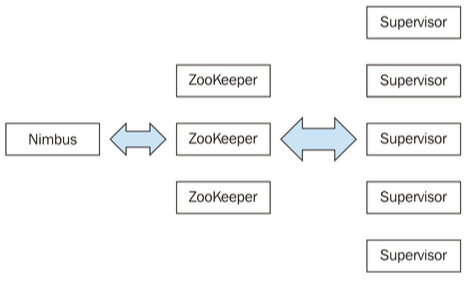
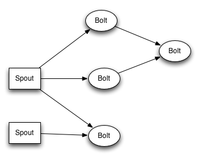
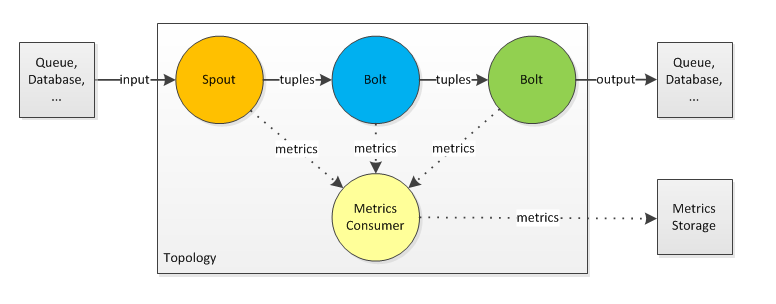
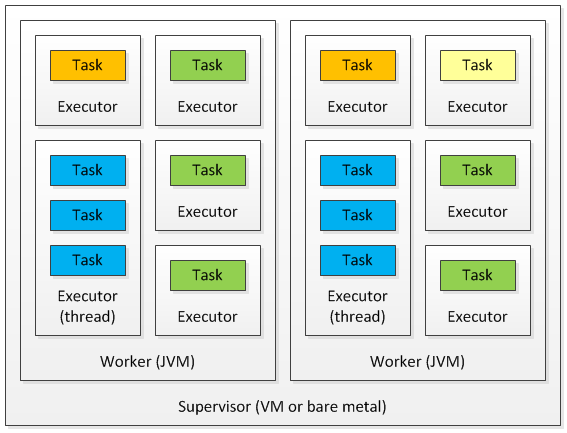
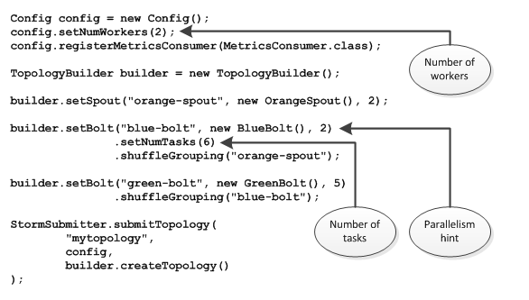

# Introduction

## What's Apache Storm?

Apache Storm is a free and open source **distributed realtime computation system**. It makes it easy
to reliably process unbounded streams of data, **doing for realtime processing what Hadoop did for
batch processing**.

> Storm is to real-time processing what Hadoop is to batch processing.

## Use cases

- **Stream processing**
- **Continuous computation** (i.e.: aggregations)
- **Distributed RPC (DRPC)** The idea behind distributed RPC (DRPC) is to parallelize the
  computation of really intense functions on the fly using Storm
- **Real-time analytics**

## Features

- Fast
- Horizontally scalable
- Fault tolerant
- Guaranteed data processing
- Easy to operate
- Programming language agnostic

## Storm components

### Zookeeper

*A Storm cluster follows a master-slave model where the master and slave processes are coordinated
through ZooKeeper*. The following are the components of a Storm cluster. All of the states
associated with the cluster and the various tasks submitted to Storm are stored in ZooKeeper. Nimbus
and supervisor nodes do not communicate directly with each other, but through ZooKeeper. As all data
is stored in ZooKeeper, both Nimbus and the supervisor daemons can be killed abruptly without
adversely affecting the cluster.

### Nimbus

The Nimbus node is the single stateless master in a Storm cluster (it stores all of its data in ZK).
It is responsible for distributing the application code across various worker nodes, assigning tasks
to different machines, monitoring tasks for any failures, and restarting them as and when required.
If the active node goes down, then the passive node will become an Active node.

The Storm workers can work smoothly even if all the Nimbus nodes go down but the user can't submit
any new jobs into the cluster or the cluster will not be able to reassign the failed workers to
another node.

### Supervisor nodes

**Supervisor nodes are the worker nodes in a Storm cluster**. **Each supervisor node runs a
supervisor daemon that is responsible for creating, starting, and stopping worker processes to
execute the tasks assigned to that node**. Like Nimbus, a supervisor daemon is also fail- fast and
stores all of its states in ZooKeeper so that it can be restarted without any state loss. A single
supervisor daemon normally handles multiple worker processes running on that machine.



### Storm data model

**The basic unit of data that can be processed by a Storm application is called a tuple**. Each
tuple consists of a predefined list of fields. The value of each field can be a byte, char, integer,
long, float, double, Boolean, or byte array. Storm also provides an API to define your own
datatypes, which can be serialized as fields in a tuple. A tuple is dynamically typed, that is, you
just need to define the names of the fields in a tuple and not their datatype.

### Storm topology

In Storm terminology, a topology is an abstraction that defines the graph of the computation. **You
create a Storm topology and deploy it on a Storm cluster to process data**. A topology can be
represented by a direct acyclic graph (DAG), where each node does some kind of processing and
forwards it to the next node(s) in the flow. The following diagram is a sample Storm topology:



#### Tuple (Message)

A single message/record that flows between the different instances of a topology is called a tuple.

#### Stream

The key abstraction in Storm is that of a stream. **A stream is an unbounded sequence of tuples that
can be processed in parallel by Storm. Each stream can be processed by a single or multiple types of
bolts**

#### Spout (Source)

A spout is the source of tuples in a Storm topology. **It is responsible for reading or listening to
data from an external source**, for example, by reading from a log file or listening for new
messages in a queue and publishing them—**emitting into Storm streams**. **A spout can emit multiple
streams, each of a different schema**. **Storm track all the tuples containing a message ID during
the processing across the cluster, if tuples doesn't have a message ID tracking is skipped**.

#### Bolt (Processor)

A bolt is the processing powerhouse of a Storm topology and is responsible for transforming a
stream.

### Operation Modes

Storm has two modes of operation: **local mode** and **remote mode**. In local mode, you can develop
and test topologies completely in process on your local machine. In remote mode, you submit
topologies for execution on a cluster of machines.

# TL;DR

> Taken from https://jansipke.nl/storm-in-pictures/

- A topology is a description of a workflow. It defines how the code you write is put together and
  executed.
- A spout is responsible for data input. Storm does not impose any restriction on the source of the
  data. Hadoop, for example, wants the data to be in its own filesystem, HDFS. With Storm, you can
  use any data source you want as long as you’re able to write a piece of code for it that fetches
  this data. Typically, the input data comes from a queue such as Kafka or ActiveMQ, but databases,
  filesystems or web servers are also fine.
- A bolt is responsible for processing the data. It gets data from a spout or another bolt in the
  form of tuples. A tuple is a lightweight data format provided by Storm that you can use to wrap
  the data you actually need to process. A bolt either processes the input data and sends it out as
  another tuple (or set of tuples), or it stores it in some external system. This could be yet
  another queue, database, filesystem, etc.
- Storm 0.9 added the notion of a metrics consumer. It is often helpful to know what is going on in
  your topology. The Storm UI provides some insight, but this is on a general level, i.e. it shows
  how many tuples were transmitted between spouts and bolts, and how many were acknowledged or
  failed. It can’t tell anything about the internal state of your spouts and bolts, because that is
  application specific. This is where the metrics framework, and the metrics consumer in particular,
  comes into play. The metrics framework allows you to create metrics variables in your spouts and
  bolts. These metrics are transmitted to the metrics consumer. Like the bolts, it is then your
  responsibility to push these metrics to an external system for storage or visualization.



- There is a single master node that is responsible for the scheduling of tasks in the cluster. One
  process on this machine is called Nimbus, which performs the actual scheduling of tasks. Another
  process is the Storm UI, which can be used to view the cluster and the topologies.
- There are several slave nodes that actually execute your code. One process on these machines is
  the Supervisor, which supervises the process that actually executes your code. Another process,
  new since Storm 0.9, is the Logviewer. It is now possible to use the Storm UI, pinpoint any
  problem in the execution of your code and then click through to the logfile on the slave node that
  executed the code.
- Storm uses ZooKeeper to perform cluster management. In a development environment, a single
  ZooKeeper node is fine. In a production environment, it is necessary to use three, five or more (
  2n+1) nodes.


- Storm tries to make use of as much parallelism as possible. To achieve this, it uses multiple
  machines (supervisors), runs several Java virtual machines on each machine (workers) and uses many
  threads per JVM (executors). The following picture illustrates this:



- The number of supervisors depends on the number of machines you have installed the Storm
  supervisor process on. The number of workers each of these machines run is configured in the *
  storm.yaml* configuration file. By default there are four worker processes (JVMs)  per supervisor,
  but this can be changed by adding port numbers to this file.

```yaml
supervisor.slots.ports:
  - 6700
  - 6701
  - 6702
  - 6703
```

- The number of supervisors and workers that are useable by Storm are now set. Now we can tell Storm
  how we want to run our topology on this cluster:



We start by creating a Config object and setting the number of workers we want to use for this
specific topology. In this case we selected two of them. Then we create a TopologyBuilder object and
set our spout, our bolts and our metrics consumer. We can set two parameters that tell Storm how
many to have of these components and how parallel they should be executed:

- The first parameter is the parallelism hint. This tells Storm how many executors (threads) should
  be used for this component. By default this number is equal to 1.
- The second number we can set is the number of tasks. This tells Storm how many times the component
  should be present in total. If the number of tasks is higher than the parallelism hint, then there
  will be executors that run more than one task serially. For example, when using a parallelism hint
  of 2 and a number of tasks of 6, there will be 2 executors that run 3 components serially. By
  default the number of tasks is equal to the parallelism hint.