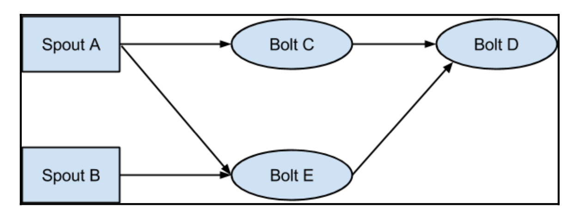
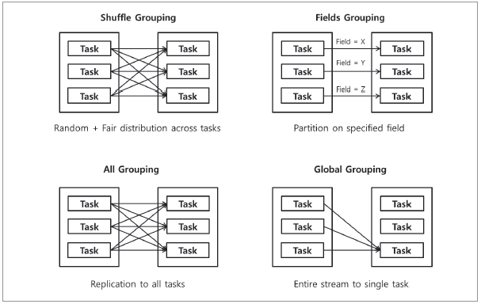
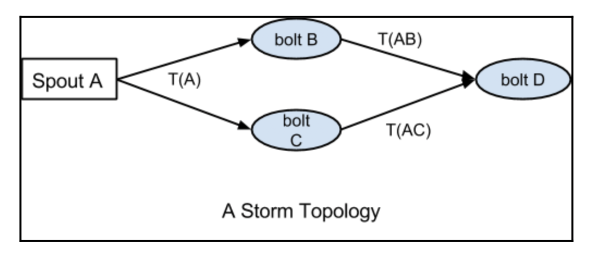

# Storm Parallelism and Data Partitioning

## Parallelism of a topology

Parallelism means the distribution of jobs on multiple nodes/instances where each instance can work
independently and can contribute to the processing of data.

### Worker process (A JVM instance)

A Storm topology is executed across multiple supervisor nodes in the Storm cluster. **Each of the
nodes in the cluster can run one or more JVMs called worker processes**, which are responsible for
processing a part of the topology. **A worker process is specific to one of the specific topologies
and can execute multiple components of that topology. If multiple topologies are being run at the
same time, none of them will share any of the workers**, thus providing some degree of isolation
between topologies.

### Executor

Within each worker process, there can be multiple threads executing parts of the topology. **Each of
these threads is called an executor. An executor can execute only one of the components, that is,
any spout or bolt in the topology**. Each executor, being a single thread, can execute only tasks
assigned to it serially. The number of executors defined for a spout or bolt can be changed
dynamically while the topology is running.

### Task

This is the most granular unit of task execution in Storm. Each task is an instance of a spout or
bolt. When defining a Storm topology, you can specify the number of tasks for each spout and bolt.
Once defined, the number of tasks cannot be changed for a component at runtime. Each task can be
executed alone or with another task of the same type, or another instance of the same spout or bolt.


## Configure parallelism at the code level

Storm provides an API to set the number of worker processes, number of executors, and number of
tasks at the code level.

```java
Config conf=new Config();
    conf.setNumWorkers(3);
```

We can set the number of executors at the code level by passing the parallelism_hint argument in
the `setSpout` and `setBolt` methods of class `org.apache.storm.topology.TopologyBuilder`.

In code sample, we set `parallelism_hint=2` for SampleSpout and `parallelism_hint=4`
for `SampleBolt`. At the time of execution, Storm will assign two executors for `SampleSpout` and
four executors for `SampleBolt`.

We can configure the number of tasks that can execute inside the executors. Here is the code snippet
to show these settings in practice:

```java
builder.setSpout("SampleSpout",new SampleSpout(),2).setNumTasks(4);
```

In the preceding code, we have configured the two executors and four tasks of `SampleSpout`.
For `SampleSpout`, **Storm will assign two tasks per executor. By default, Storm will run one task
per executor if the user does not set the number of tasks at the code level**.

## Worker process, executor, and task distribution

Let's assume that we have:

- Worker processes set for the topology: 3
- Executors per `SampleSpout`: 3
- Executors per `SampleBolt`: 3
- Tasks of `SampleBolt`: 6

> Since `SampleBolt` are 6 tasks, it means 2 tasks per each of its 3 executors

So we have that: **total parallelism** = 3 spouts + 6 bolts = 9 tasks

## Rebalance the parallelism of a topology

One of the key features of Storm is that it allows us to modify the parallelism of a topology at
runtime. The process of updating a topology parallelism at runtime is called rebalance.

There are two ways to rebalance the topology:

- Using Storm Web UI
- Using Storm CLI

Here are the commands that we need to execute on Storm CLI to rebalance the topology:

```shell
storm rebalance [TopologyName] -n [NumberOfWorkers] \
    -e [Spout]=[NumberOfExecutos] \
    -e [Bolt1]=[NumberOfExecutos] [Bolt2]=[NumberOfExecutos]
```

The `rebalance` command will first deactivate the topology for the duration of the message timeout
and then redistribute the workers evenly around the Storm cluster. After a few seconds or minutes,
the topology will revert to the previous state of activation and restart the processing of input
streams.

## Different types of stream grouping (partitioning) in the Storm cluster

Stream grouping in Storm provides complete control over how partitioning of tuples happens among the
many tasks of a bolt subscribed to a stream. Storm supports the following types of stream
groupings (partitioners):

### Suffle grouping

Shuffle grouping distributes tuples in a uniform, random way across the tasks. An equal number of
tuples will be processed by each task. This grouping is ideal when you want to distribute your
processing load uniformly across the tasks and where there is no requirement for any data-driven
partitioning.

### Field grouping

As a result of the field grouping being hash `(fields) % (no. of tasks)`, it does not guarantee that
each of the tasks will get tuples to process. For example, if you have applied a field grouping on a
field, say `X`, with only two possible values, `A` and `B`, and created two tasks for the bolt, then
it might be possible that both `hash (A) % 2` and `hash (B) % 2` return equal values, which will
result in all the tuples being routed to a single task and the other being completely idle.

Another common usage of field grouping is to join streams. Since partitioning happens solely on the
basis of field values, and not the stream type, we can join two streams with any common join fields.
The name of the fields needs not be the same. For example, in the order processing domain, we can
join the Order stream and the ItemScanned stream to see when an order is completed:

```java
builder.setSpout("1", new OrderSpout());
builder.setSpout("2", new ItemScannedSpout());
builder.setBolt("joiner", new OrderJoiner())
    .fieldsGrouping("1", new Fields("orderId"))
    .fieldsGrouping("2", new Fields("orderRefId"));
```

### All grouping

**All grouping is a special grouping that does not partition the tuples but replicates them to all
the tasks, that is, each tuple will be sent to each of the bolt's tasks for processing**.

One common use case of all grouping is for sending signals to bolts. For example, if you are doing
some kind of filtering on the streams, you can pass or change the filter parameters to all the bolts
by sending them those parameters over a stream that is subscribed by all the bolt's tasks with an
all grouping. Another example is to send a reset message to all the tasks in an aggregation bolt.

### Global grouping

Global grouping does not partition the stream but sends the complete stream to the bolt's task, the
smallest ID.

Global grouping might seem redundant at first, as you can achieve the same results by defining the
parallelism for the bolt as one if you only have one input stream. However, when you have multiple
streams of data coming through a different path, you might want only one of the streams to be
reduced and others to be parallel processes. For example, consider the following topology. In this,
you might want to combine all the tuples coming from Bolt C in a single Bolt D task, while you might
still want parallelism for tuples coming from Bolt E to Bolt D:



### Direct grouping

In direct grouping, the emitter decides where each tuple will go for processing. For example, say we
have a log stream and we want to process each log entry to be processed by a specific bolt task on
the basis of the type of resource. In this case, we can use direct grouping. Direct grouping can
only be used with direct streams. The `emitDirect` method takes a `taskId` parameter to specify the
task. You can get the number of tasks for a component using
the `backtype.storm.task.TopologyContext.getComponentTasks` method.

### Local or shuffle grouping

If the tuple source and target bolt tasks are running in the same worker, using this grouping will
act as a shuffle grouping only between the target tasks running on the same worker, thus minimizing
any network hops, resulting in increased performance. If there are no target bolt tasks running on
the source worker process, this grouping will act similar to the shuffle grouping mentioned earlier.

### None grouping

None grouping is used when you don't care about the way tuples are partitioned among various tasks.
As of Storm 0.8, this is equivalent to using shuffle grouping.

### Custom grouping

If none of the preceding groupings fit your use case, you can define your own custom grouping by
implementing the `backtype.storm.grouping.CustomStreamGrouping` interface.

> Guava is included in storm-core

```java
public class CategoryGrouping implements CustomStreamGrouping, Serializable {

  private static final Map<String, Integer> categories = ImmutableMap.of(
      "Financial", 0,
      "Medical", 1,
      "FMCG", 2,
      "Electronics", 3
  );
  private int tasks = 0;

  public void prepare(WorkerTopologyContext context, GlobalStreamId stream,
      List<Integer> targetTasks) {
    tasks = targetTasks.size();
  }

  public List<Integer> chooseTasks(int taskId, List<Object> values) {
    String category = (String) values.get(0);
    return ImmutableList.of(categories.get(category) % tasks);
  }
}
```

The following diagram represents the Storm groupings graphically:



## Guaranteed message processing

Storm provides two types of guarantees when processing tuples for a Storm topology.

#### At least once

Reliable; Tuples are processed at least once, but may be processed more than once. Use when
subsecond latency is required and for unordered idempotent operations.

#### Exactly once

Tuples are processed only once. (This feature requires the use of a Trident spout and the Trident
API. For more information)

### `At-least-one` Message Processing

In a Storm topology, a single tuple being emitted by a spout can result in a number of tuples being
generated in the later stages of the topology.



Here, `Spout A` emits a tuple `T(A)`, which is processed by `bolt B` and bolt C, which emit
tuple `T(AB)` and `T(AC)` respectively. So, when all the tuples produced as a result of tuple `T(A)`
—namely, the tuple tree `T(A)`, `T(AB)`, and `T(AC)`—are processed, we say that the tuple has been
processed completely.

**When some of the tuples in a tuple tree fail to process either due to some runtime error or a
timeout that is configurable for each topology, then Storm considers that to be a failed tuple**.

Here are the six steps that are required by Storm to guarantee message processing:

1. Tag each tuple emitted by a spout with a unique message ID. Storm uses this message ID to track
   the state of the tuple tree generated by this tuple. If you use one of the emit methods that
   doesn't take a messageId argument, Storm will not track it for complete processing. When the
   message is processed completely, Storm will send an acknowledgement with the same messageId that
   was used while emitting the tuple.
2. A generic pattern implemented by spouts is that they read a message from a messaging queue, say
   RabbitMQ, produce the tuple into the topology for further processing, and then dequeue the
   message once it receives the acknowledgement that the tuple has been processed completely.
3. When one of the bolts in the topology needs to produce a new tuple in the course of processing a
   message, for example, `bolt B` in the preceding topology, then it should emit the new tuple
   anchored with the original tuple that it got from the spout.
4. Whenever you are done with processing a tuple in the execute method of your bolt, send an
   acknowledgment.
5. If there is some problem in processing a tuple, a failure signal should be sent back.
6. **One of the general patterns of processing in Storm bolts is to process a tuple in, emit new
   tuples, and send an acknowledgement at the end of the execute method**.

This model results in `at-least-once` message processing semantics, and **your application should be
ready to handle a scenario when some of the messages will be processed multiple times**.

## Tick tuple

The tick tuple is a storm-generated tuple that we can configure at each bolt level, mainly for
executing periodic tasks in the bolts (like cleaning a cache). The developer can configure the tick
tuple at the code level while writing a bolt.

```java
  public Map<String, Object> getComponentConfiguration() {
    Config conf = new Config();
    int tickFrequencyInSeconds = 10;
    conf.put(Config.TOPOLOGY_TICK_TUPLE_FREQ_SECS,
        tickFrequencyInSeconds);
    return conf;
  }
```

In the preceding code, we have configured the tick tuple time to 10 seconds. Now, Storm will start
generating a tick tuple after every 10 seconds.

We'd require to prepare our code to identify it:

```java
  public void execute(Tuple tuple) {
    if (isTickTuple(tuple)) {
      // now you can trigger e.g. a periodic activity
    } else {
      // do something with the normal tuple
    }
  }

  private static boolean isTickTuple(Tuple tuple) {
    return
        tuple.getSourceComponent().equals(Constants.SYSTEM_COMPONENT_ID) &&
            tuple.getSourceStreamId().equals(Constants.SYSTEM_TICK_STREAM_ID);
  }
```